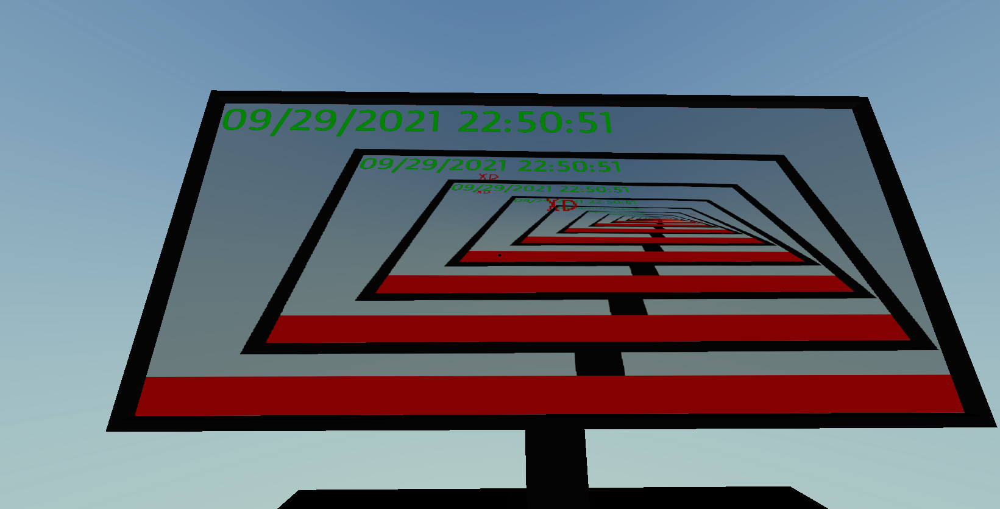
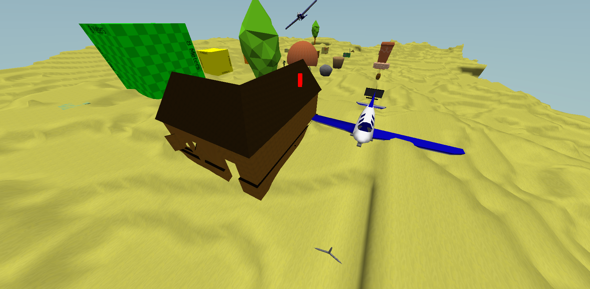
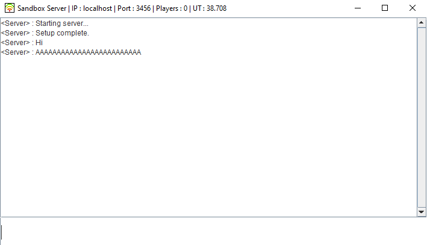

#  Auravyx (Java Voxel Game)

---

A Java 3D voxel based sandbox with dynamic worlds, mobs and more! This version is rather old and has been moved to C++. 
This project was worked on and off between Feburary and July 2017, at which point I eventually moved on to C++.

This one has full 3D physics with terrain and objects which uses mesh data to make a custom collision mesh.

Gallery:

